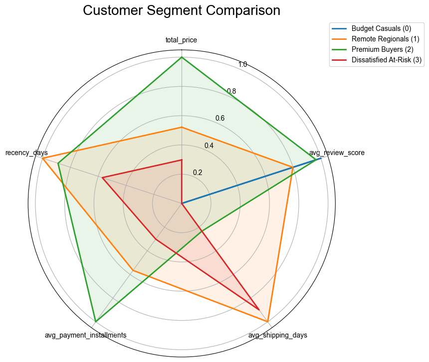
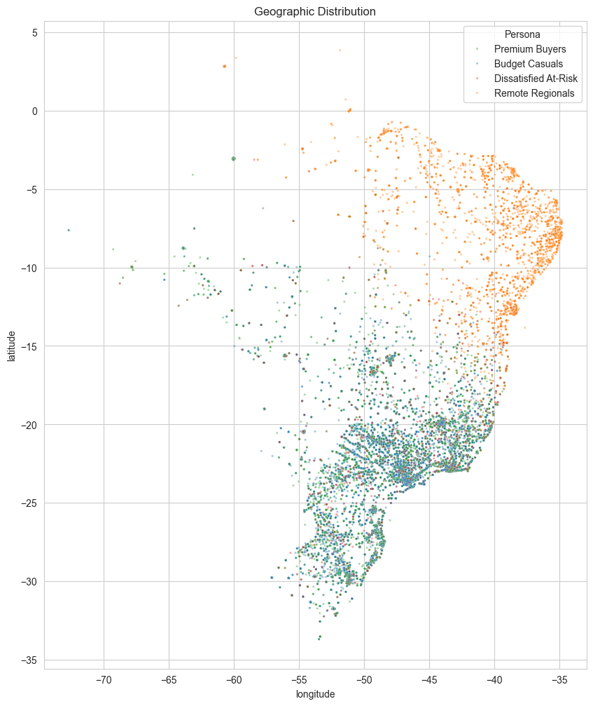

# Customer Segmentation Analysis — Olist E-Commerce

## Overview

Segmented **93,000+ customers** of a Brazilian e-commerce marketplace into four actionable groups using K-Means clustering, validated with Hierarchical Clustering and DBSCAN. The analysis identifies distinct customer personas based on purchasing behavior, delivery experience, geographic location, and satisfaction — enabling targeted marketing strategies and operational improvements.

**Dataset:** [Olist Brazilian E-Commerce](https://www.kaggle.com/datasets/olistbr/brazilian-ecommerce) (~100K orders, 2016–2018, 9 relational tables)

**Tools:** Python, Pandas, Scikit-learn, Seaborn, Matplotlib, SciPy

---

## Key Results

### Four Customer Segments

| Segment | Size | Avg Spend (R$) | Avg Review | Avg Delivery (days) | Defining Trait |
|---------|------|----------------|------------|---------------------|----------------|
| **Budget Casuals** | 44,209 (47%) | 67 | 4.65 | 9 | Happy one-time buyers, small items, fast delivery |
| **Dissatisfied At-Risk** | 27,081 (29%) | 125 | 1.62 | 19 | Poor experience, longest delivery, lowest satisfaction |
| **Premium Buyers** | 12,273 (13%) | 261 | 4.55 | 11 | High-value, heavy items, most installments |
| **Remote Regionals** | 9,773 (10%) | 168 | 4.04 | 20 | Northeast Brazil, far from logistics hubs |

### Segment Profiles (Radar Chart)



### Geographic Distribution



Remote Regionals (orange) cluster distinctly in Brazil's Northeast coast, while other segments overlap in the Southeast around São Paulo.

---

## Methodology

### 1. Data Cleaning & Merging
- Filtered to delivered orders only (~96K)
- Resolved duplicate reviews, cleaned erroneous geolocation coordinates
- Built unified order-item dataframe via 6-table merge chain using left joins

### 2. Customer-Level Aggregation
- Collapsed to **one row per unique customer** (not per order — critical distinction)
- Engineered 16 features across monetary, frequency, recency, product behavior, payment, satisfaction, delivery, and geography dimensions
- Used `customer_unique_id` (not `customer_id`) since Olist assigns new IDs per order

### 3. Feature Preparation
- Log-transformed skewed monetary and weight features
- Removed near-zero variance features (`order_count`, `total_items`, `unique_categories` — 97% of customers had value of 1)
- Dropped `avg_order_value` (0.92 correlation with `total_price`)
- StandardScaler applied to final 9 features

### 4. Clustering
- **K-Means (k=4):** Selected via elbow method + silhouette analysis. Silhouette scores 0.12–0.19, typical for real-world customer data
- **Hierarchical (Ward's):** 90%+ label agreement with K-Means — validates the 4-cluster structure as a genuine property of the data
- **DBSCAN (eps=1.2):** Placed 91.5% in one cluster, confirming customer behavior forms a continuous distribution rather than density-separated groups. K-Means provides more actionable segmentation

---

## Business Recommendations

| Segment | Strategy | Expected Impact |
|---------|----------|-----------------|
| **Budget Casuals** | Upsell via targeted product recommendations; free shipping on second order | Convert one-time buyers to repeat customers |
| **Dissatisfied At-Risk** | Root cause analysis on delivery failures; personalized recovery offers | Reduce churn in a 29% segment |
| **Premium Buyers** | VIP treatment — priority shipping, early sale access, loyalty tiers | Retain highest-revenue customers |
| **Remote Regionals** | Regional fulfillment centers; proactive delivery communication | Improve satisfaction in underserved Northeast |

---

## Key Insights

- **Delivery drives satisfaction:** Review scores and shipping days correlate at -0.33. Customers with 19+ day deliveries scored 1.6 vs 4.65 for those with 9-day deliveries
- **Geography matters:** Clustering naturally separated the Northeast (Remote Regionals) from the Southeast, reflecting real logistics infrastructure gaps
- **Most customers are one-time buyers:** ~97% placed a single order, meaning segmentation differentiates by *how* customers bought, not how *often*
- **Credit card dominates all segments** (~75%), so payment type doesn't differentiate personas

---

## Project Structure

```
Customer-Segmentation-Olist/
├── data/                          # Raw CSVs (not tracked — see .gitignore)
├── notebooks/
│   └── customer_segmentation.ipynb
├── visuals/                       # Exported charts
│   ├── cluster_radar_chart.png
│   ├── geographic_scatter.png
│   ├── correlation_matrix.png
│   └── cluster_distribution.png
├── customer_segments.csv          # Final output with cluster labels
├── requirements.txt
├── .gitignore
└── README.md
```

---

## How to Run

1. Clone the repository
2. Download the [Olist dataset](https://www.kaggle.com/datasets/olistbr/brazilian-ecommerce) and place CSVs in `data/`
3. Install dependencies: `pip install -r requirements.txt`
4. Open and run `notebooks/customer_segmentation.ipynb`

---

## Requirements

```
pandas>=1.5.0
numpy>=1.23.0
matplotlib>=3.6.0
seaborn>=0.12.0
scikit-learn>=1.2.0
scipy>=1.10.0
```

---

## Next Steps

- **Power BI Dashboard:** Interactive visualization of segment profiles using the exported `customer_segments.csv` (in progress)
